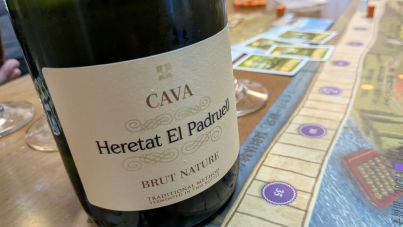

毎月恒例の友人宅でのワイナリーの四季。まず飲んだワインはサムネにも使っているコノスルのビシクレタレゼルバ ゲヴュルツトラミネール。コノスルと言えば、もし僕が会社の偉い人に食事に誘われて

「君はワインを飲むのかい？」

と聞かれた場合

「普段はコノスルしか飲みません」

と答え、偉い人から

「コノスルのワインは安くて美味しいよね」

と会話したい、そういうイメトレをするくらいワインを飲む人の中では名前の挙がる製造元。一度飲んでみたいと思っていたので、まさにタイミングばっちりでした。

コノスルはコスパワインの代名詞。安くて美味しいチリワイン。単一のブドウ種で作られることが多く（フランスのワインは複数のブドウ種をブレンドして作成されることが多いです）、初心者がワインにおけるブドウの特徴をつかむにはうってつけです。ちなみに「レゼルバ」とは、長く熟成させたワインのことを言います。
ブドウ種の「ゲヴュルツトラミネール」はその名の通りドイツやフランスで栽培される白ワイン用のブドウ種で、香りが特徴的とされます。このワインもライチっぽい香りがします。ただ自分はあまり好みの香りではありませんでした。
味は素直で分かりやすい辛口のワイン。一緒に飲んだ友人は「暖かい地域の白ワインの味がする」と言っていましたが、そもそも自分がそこまで白ワインを飲んでいないため、暖かい地域と涼しい知識の白ワインの差が分かりませんw

もう一本飲んだのは「ハウメ セラ エレタット エル パドルエル ブリュット ナチューレ」。こちらもリーズナブルなスパークリングワイン。
ハウメ セラ社はスペインの老舗ワインメーカー。このワインは「カヴァ」です。「カヴァ」とは、スペインのワイン法で定められた、シャンパンと同じ瓶内二次発酵方式で造られるスパークリングワインのことを指します。
コノスルの白ワインより辛めで、王道のスパークリングワインの味でした。ネットで調べたらこれも800円くらいで手に入るとのこと。

この日のワイナリーの四季は初めてトスカーナの拡張ルールその２「特殊労働者」を使って遊びました。
特殊労働者はその名の通り通常の労働者とは異なる特殊な能力を持つ労働者を使うことができるルールです。11人の特殊労働者からランダムで利用できる特殊労働者を選択します。今回選ばれた特殊労働者は

- 農夫：早い者勝ちでもらえるアクションのボーナスを、後からマスに入った場合も得ることができる。
- 兵士：兵士がアクションゾーンに配置されている場合、後から労働者を配置する際、1リラ払う必要がある。ただし、配置可能なスペースがすべて埋まっていたとしても労働者を配置できる。

さっそく最短で両方の特殊労働者を訓練して使ってみました。
農夫は1年に1回だけですが、遅く起きたとしてもアクションのボーナスをもらえるのはシンプルにメリットがあります。
一方で兵士はなかなか曲者です。これまでワイナリーの四季には”アクションゾーンが空いているのに、余っている労働者を置きたくても置けない”というシチュエーションは存在しませんでした。兵士が睨みを利かせると、賄賂を持っていかないとアクションができなくなります。しかし一方で、わいろを渡せば親方でなくても（アクションマスが埋まっていたとしても）アクションを実行できることができます。つまり他のプレイヤーがお金を潤沢に持っている場合、却って相手を助けることができてします。ワイナリーの四季において、特に終盤はお金の重要性は下がりがちでしたので、この兵士の存在はゲームの立ち回りを大きく変えることができます。特殊労働者は他にもいろいろな種類があり、自分たちは効果を知らないのですが、シンプルなルールでゲームに少し隠し味を入れてくれる面白い要素のように思えます。

この日のワイナリーの四季は3名でトスカーナ拡張＋特殊労働者で遊びました。

- 私
- カントク
- ダイヒョー

私たちも月1とはいえ2年近くワイナリーの四季をやってきました。慣れてきたため、熟考しつつも展開はスピーディに。過去最高に厳しい戦いが展開されました。コンスタンスな出荷でリードを広げるダイヒョー。24点まで迫ります。しかし次のターンで2つ出荷して大逆転だ、ともくろんでいたら、バルクワインを出荷され1点ゲット。その手があったか…次のターンが来ませんでした。我々のワイナリー経営もだいぶレベルが上がりました。

